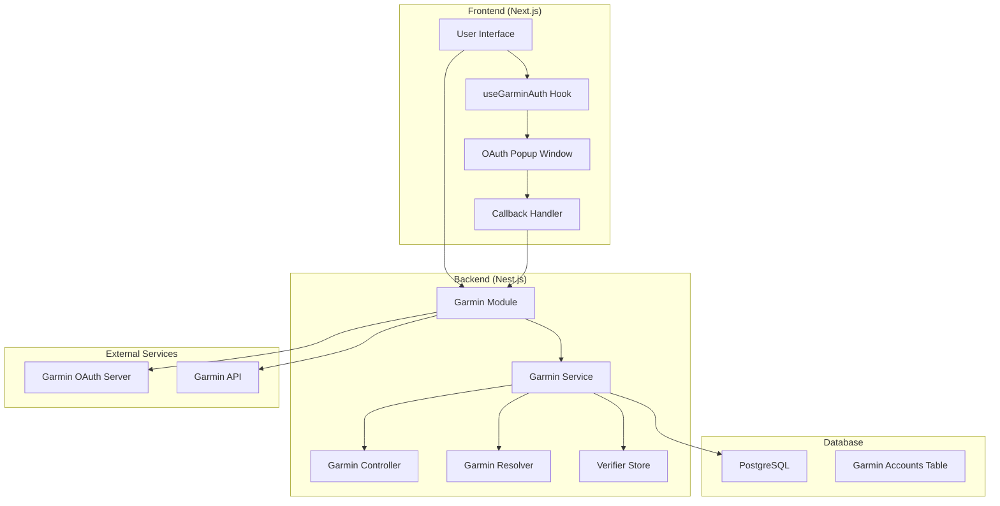
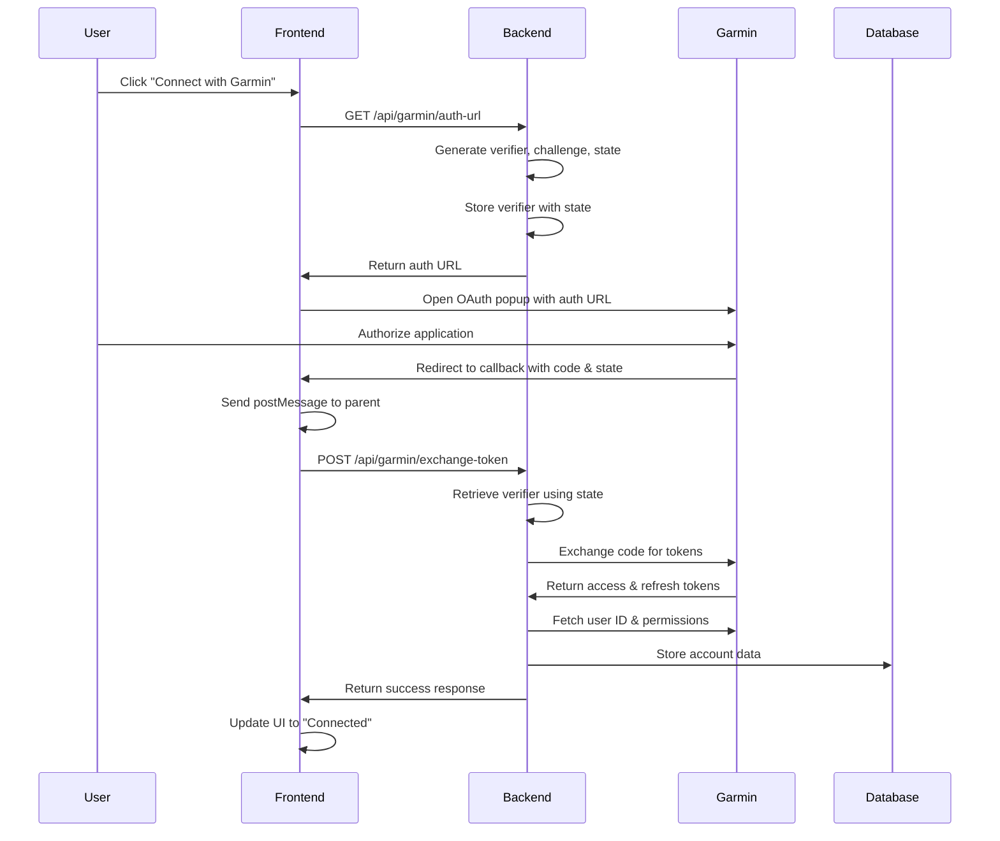
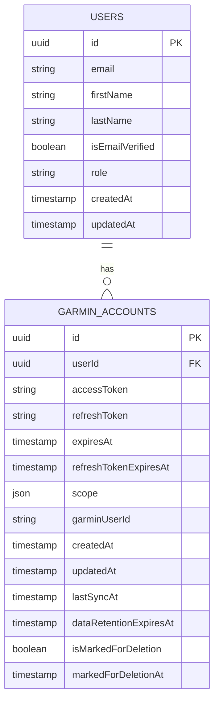
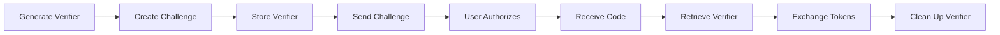

# Garmin OAuth2 PKCE Implementation Guide

## Table of Contents

- [Overview](#overview)
- [Architecture](#architecture)
- [OAuth2 PKCE Flow](#oauth2-pkce-flow)
- [Implementation Details](#implementation-details)
- [Database Schema](#database-schema)
- [API Endpoints](#api-endpoints)
- [Frontend Integration](#frontend-integration)
- [Security Considerations](#security-considerations)
- [Troubleshooting](#troubleshooting)
- [Testing](#testing)

## Overview

This document describes the complete implementation of Garmin OAuth2 PKCE (Proof Key for Code Exchange) flow in a Nest.js backend with Next.js frontend. The implementation allows users to securely connect their Garmin accounts to retrieve activity data.

### Key Features

- ✅ OAuth2 PKCE flow for enhanced security
- ✅ Automatic token refresh
- ✅ Permission-based data access
- ✅ Secure verifier storage
- ✅ Cross-origin communication handling
- ✅ Comprehensive error handling

## Architecture



## OAuth2 PKCE Flow

### Flow Diagram



### Step-by-Step Process

1. **Authorization Request**

   - Frontend requests auth URL from backend
   - Backend generates PKCE verifier, challenge, and state
   - Verifier is stored temporarily with state as key
   - Auth URL includes challenge and state

2. **User Authorization**

   - User completes OAuth flow on Garmin
   - Garmin redirects to callback with authorization code

3. **Token Exchange**

   - Frontend sends code and state to backend
   - Backend retrieves verifier using state
   - Backend exchanges code for tokens using verifier
   - Verifier is cleaned up after use

4. **Account Setup**
   - Backend fetches user ID and permissions from Garmin
   - Account data is stored in database
   - Frontend updates UI to show connected status

## Implementation Details

### Backend Implementation

#### 1. Garmin Service (`garmin.service.ts`)

```typescript
@Injectable()
export class GarminService {
  // Temporary storage for PKCE verifiers
  private verifierStore = new Map<
    string,
    {
      verifier: string
      userId: string
      timestamp: number
    }
  >()

  // Generate PKCE verifier
  private generateCodeVerifier(): string {
    return crypto.randomBytes(32).toString('base64url')
  }

  // Generate code challenge from verifier
  private generateCodeChallenge(verifier: string): string {
    const hash = crypto.createHash('sha256').update(verifier).digest()
    return hash.toString('base64url')
  }

  // Build authorization URL
  buildAuthUrl(userId: string): {
    url: string
    state: string
    verifier: string
  } {
    const verifier = this.generateCodeVerifier()
    const challenge = this.generateCodeChallenge(verifier)
    const state = this.generateState()

    // Store verifier temporarily
    this.verifierStore.set(state, {
      verifier,
      userId,
      timestamp: Date.now(),
    })

    // Build auth URL with PKCE parameters
    const authUrl = new URL('https://connect.garmin.com/oauth2Confirm')
    authUrl.searchParams.append('code_challenge', challenge)
    authUrl.searchParams.append('code_challenge_method', 'S256')
    authUrl.searchParams.append('state', state)
    // ... other parameters

    return { url: authUrl.toString(), state, verifier }
  }

  // Exchange code for tokens
  async exchangeCodeForTokens(
    code: string,
    state: string
  ): Promise<{ tokens: any; userId: string }> {
    // Retrieve verifier from storage
    const storedData = this.verifierStore.get(state)
    if (!storedData) {
      throw new HttpException(
        'Invalid or expired state parameter',
        HttpStatus.BAD_REQUEST
      )
    }

    const { verifier, userId } = storedData
    this.verifierStore.delete(state) // Clean up

    // Exchange code for tokens with verifier
    const response = await this.httpService.post(
      'https://diauth.garmin.com/di-oauth2-service/oauth/token',
      new URLSearchParams({
        grant_type: 'authorization_code',
        code,
        code_verifier: verifier,
        // ... other parameters
      })
    )

    return { tokens: response.data, userId }
  }
}
```

#### 2. Garmin Controller (`garmin.controller.ts`)

```typescript
@Controller('garmin')
export class GarminController {
  @Get('auth-url')
  @UseGuards(JwtAuthGuard)
  async getAuthUrl(@Req() req: Request) {
    const userId = req.user['id']
    const { url, state } = this.garminService.buildAuthUrl(userId)
    return { url, state }
  }

  @Post('exchange-token')
  @UseGuards(JwtAuthGuard)
  async exchangeToken(@Req() req: Request, @Res() res: Response) {
    const { code, state } = req.body
    const userId = req.user['id']

    // Exchange code for tokens
    const { tokens: tokenData, userId: storedUserId } =
      await this.garminService.exchangeCodeForTokens(code, state)

    // Fetch additional data
    const garminUserId = await this.garminService.fetchGarminUserId(
      tokenData.access_token
    )
    const permissions = await this.garminService.fetchUserPermissions(
      tokenData.access_token
    )

    // Store in database
    const garminAccount = await this.garminService.storeGarminAccount(
      storedUserId,
      garminUserId,
      tokenData,
      permissions
    )

    res.json({ success: true, garminAccount })
  }
}
```

#### 3. Garmin Entity (`garmin-account.entity.ts`)

```typescript
@ObjectType()
@Entity('garmin_accounts')
export class GarminAccount {
  @Field(() => ID)
  @PrimaryGeneratedColumn('uuid')
  id: string

  @Field(() => [String])
  @Column({
    type: 'json',
    transformer: {
      to: (value: string[]) => value,
      from: (value: any) => {
        if (Array.isArray(value)) return value
        if (typeof value === 'string') return [value]
        if (value?.permissions) {
          return Array.isArray(value.permissions)
            ? value.permissions
            : [value.permissions]
        }
        return []
      },
    },
  })
  scope: string[]

  @Field()
  @Column()
  accessToken: string

  @Field()
  @Column()
  refreshToken: string

  @Field()
  @Column()
  expiresAt: Date

  // ... other fields
}
```

### Frontend Implementation

#### 1. Custom Hook (`use-garmin-auth.ts`)

```typescript
export const useGarminAuth = () => {
  const [state, setState] = useState<GarminAuthState>({
    isConnected: false,
    isConnecting: false,
    account: null,
    error: null,
  })

  // Get auth URL
  const { data: authUrlData } = useQuery(GET_GARMIN_AUTH_URL_QUERY)

  // Check connection status
  const { data: accountData, refetch: refetchConnection } = useQuery(
    GET_GARMIN_ACCOUNT_QUERY
  )

  const connectGarmin = async () => {
    if (!authUrlData?.getGarminAuthUrl) return

    setState(prev => ({ ...prev, isConnecting: true, error: null }))

    try {
      // Open OAuth popup
      const popup = window.open(
        authUrlData.getGarminAuthUrl,
        'garmin-oauth',
        'width=500,height=600'
      )

      // Listen for messages from popup
      const handleMessage = async (event: MessageEvent) => {
        if (event.data.type === 'GARMIN_OAUTH_SUCCESS') {
          try {
            // Exchange code for tokens
            const response = await fetch('/api/garmin/exchange-token', {
              method: 'POST',
              headers: {
                'Content-Type': 'application/json',
                Authorization: `Bearer ${localStorage.getItem('access_token')}`,
              },
              body: JSON.stringify({
                code: event.data.code,
                state: event.data.state,
              }),
            })

            if (!response.ok)
              throw new Error(`Token exchange failed: ${response.status}`)

            const result = await response.json()
            setState(prev => ({ ...prev, isConnecting: false }))
            refetchConnection()
          } catch (error) {
            setState(prev => ({
              ...prev,
              isConnecting: false,
              error: error.message,
            }))
          }
        }
      }

      window.addEventListener('message', handleMessage)
    } catch (error) {
      setState(prev => ({
        ...prev,
        isConnecting: false,
        error: error.message,
      }))
    }
  }

  return {
    ...state,
    connectGarmin,
    disconnectGarmin,
    refreshTokens,
  }
}
```

#### 2. Callback Handler (`callback/route.ts`)

```typescript
export async function GET(request: Request) {
  const { searchParams } = new URL(request.url)
  const code = searchParams.get('code')
  const state = searchParams.get('state')

  if (!code || !state) {
    return new Response('Missing required parameters', { status: 400 })
  }

  // Return HTML that sends message to parent window
  const html = `
    <!DOCTYPE html>
    <html>
      <head><title>Garmin OAuth Success</title></head>
      <body>
        <div style="text-align: center; padding: 50px;">
          <h2>✅ Successfully Connected!</h2>
          <p>Your Garmin account has been linked to Lominic.</p>
        </div>
        <script>
          if (window.opener) {
            window.opener.postMessage({
              type: 'GARMIN_OAUTH_SUCCESS',
              code: '${code}',
              state: '${state}'
            }, '*');
            setTimeout(() => window.close(), 2000);
          }
        </script>
      </body>
    </html>
  `

  return new Response(html, {
    headers: { 'Content-Type': 'text/html' },
  })
}
```

## Database Schema

### Garmin Accounts Table

```sql
CREATE TABLE "garmin_accounts" (
  "id" uuid NOT NULL DEFAULT uuid_generate_v4(),
  "userId" uuid NOT NULL,
  "accessToken" character varying NOT NULL,
  "refreshToken" character varying NOT NULL,
  "expiresAt" TIMESTAMP NOT NULL,
  "refreshTokenExpiresAt" TIMESTAMP NOT NULL,
  "scope" json NOT NULL,
  "garminUserId" character varying NOT NULL,
  "createdAt" TIMESTAMP NOT NULL DEFAULT now(),
  "updatedAt" TIMESTAMP NOT NULL DEFAULT now(),
  "lastSyncAt" TIMESTAMP,
  "dataRetentionExpiresAt" TIMESTAMP,
  "isMarkedForDeletion" boolean NOT NULL DEFAULT false,
  "markedForDeletionAt" TIMESTAMP,
  CONSTRAINT "PK_71074439141c5a12f5ab3563dc1" PRIMARY KEY ("id")
);
```

### Schema Diagram



## API Endpoints

### REST Endpoints

| Method | Endpoint                     | Description                 | Auth Required |
| ------ | ---------------------------- | --------------------------- | ------------- |
| GET    | `/api/garmin/auth-url`       | Get OAuth authorization URL | ✅ JWT        |
| POST   | `/api/garmin/exchange-token` | Exchange code for tokens    | ✅ JWT        |
| GET    | `/api/garmin/status`         | Get connection status       | ✅ JWT        |

### GraphQL Queries/Mutations

```graphql
# Get OAuth authorization URL
query GetGarminAuthUrl {
  getGarminAuthUrl
}

# Get connected account details
query GetGarminAccount {
  getGarminAccount {
    id
    garminUserId
    scope
    createdAt
    updatedAt
    expiresAt
    refreshTokenExpiresAt
    isMarkedForDeletion
  }
}

# Check connection status
query IsGarminConnected {
  isGarminConnected
}

# Disconnect account
mutation DisconnectGarminAccount {
  disconnectGarminAccount
}

# Refresh tokens
mutation RefreshGarminTokens {
  refreshGarminTokens
}
```

## Frontend Integration

### Component Usage

```tsx
import { useGarminAuth } from '@/hooks/use-garmin-auth'

export const GarminConnectionStatus = () => {
  const {
    isConnected,
    isConnecting,
    account,
    error,
    connectGarmin,
    disconnectGarmin,
  } = useGarminAuth()

  if (isConnecting) {
    return <div>Connecting to Garmin...</div>
  }

  if (error) {
    return <div>Error: {error}</div>
  }

  if (isConnected && account) {
    return (
      <div>
        <h3>✅ Connected to Garmin</h3>
        <p>User ID: {account.garminUserId}</p>
        <p>Permissions: {account.scope.join(', ')}</p>
        <button onClick={disconnectGarmin}>Disconnect</button>
      </div>
    )
  }

  return (
    <div>
      <h3>🔗 Connect to Garmin</h3>
      <button onClick={connectGarmin}>Connect with Garmin</button>
    </div>
  )
}
```

## Security Considerations

### PKCE Implementation



### Security Features

1. **PKCE Flow**: Prevents authorization code interception attacks
2. **State Parameter**: Prevents CSRF attacks
3. **Verifier Storage**: Temporary in-memory storage with automatic cleanup
4. **JWT Authentication**: All endpoints require valid JWT tokens
5. **HTTPS Only**: All communications use HTTPS in production
6. **Token Refresh**: Automatic token refresh before expiration

### Environment Variables

```bash
# Garmin OAuth Configuration
GARMIN_CLIENT_ID=your_client_id
GARMIN_CLIENT_SECRET=your_client_secret
GARMIN_REDIRECT_URI=http://localhost:3000/api/auth/garmin/callback
GARMIN_SCOPES=ACTIVITY_EXPORT HEALTH_EXPORT

# Session Configuration
SESSION_SECRET=your_session_secret

# API Configuration
NEXT_PUBLIC_API_URL=http://localhost:4000
```

## Troubleshooting

### Common Issues

#### 1. "Invalid or expired state parameter"

- **Cause**: State parameter not found in verifier store
- **Solution**: Check if verifier cleanup is working properly
- **Debug**: Add logging to verifier store operations

#### 2. "Token exchange failed: invalid_request"

- **Cause**: Incorrect verifier or expired authorization code
- **Solution**: Ensure PKCE flow is implemented correctly
- **Debug**: Verify verifier generation and storage

#### 3. "Expected Iterable, but did not find one for field scope"

- **Cause**: Database contains string instead of array
- **Solution**: Use column transformer to handle format conversion
- **Debug**: Check database content and entity configuration

#### 4. "Cannot GET /api/garmin/auth-url"

- **Cause**: Controller not registered or wrong route
- **Solution**: Ensure module is imported and routes are correct
- **Debug**: Check NestJS module configuration

### Debug Checklist

- [ ] Environment variables are set correctly
- [ ] Garmin Developer Portal configuration is correct
- [ ] OAuth redirect URL matches exactly
- [ ] Database migrations have been run
- [ ] JWT tokens are valid and not expired
- [ ] CORS is configured properly
- [ ] All required dependencies are installed

## Testing

### Manual Testing Flow

1. **Setup Environment**

   ```bash
   # Start backend
   cd apps/api && npm run start:dev

   # Start frontend
   cd apps/web && npm run dev
   ```

2. **Test OAuth Flow**

   - Navigate to Garmin integration page
   - Click "Connect with Garmin"
   - Complete OAuth authorization
   - Verify connection status updates

3. **Test Token Refresh**

   - Wait for token to expire (or manually expire)
   - Trigger an API call
   - Verify automatic token refresh

4. **Test Disconnection**
   - Click "Disconnect"
   - Verify account is marked for deletion
   - Verify UI updates to "Not Connected"

### API Testing

```bash
# Test auth URL endpoint
curl -X GET http://localhost:4000/api/garmin/auth-url \
  -H "Authorization: Bearer YOUR_JWT_TOKEN"

# Test token exchange (with valid code)
curl -X POST http://localhost:4000/api/garmin/exchange-token \
  -H "Content-Type: application/json" \
  -H "Authorization: Bearer YOUR_JWT_TOKEN" \
  -d '{"code":"VALID_CODE","state":"VALID_STATE"}'
```

### GraphQL Testing

```graphql
# Test connection status
query {
  isGarminConnected
}

# Test account details
query {
  getGarminAccount {
    id
    garminUserId
    scope
    createdAt
  }
}
```

## Conclusion

This implementation provides a secure, production-ready OAuth2 PKCE flow for Garmin integration. The architecture separates concerns between frontend and backend, implements proper security measures, and includes comprehensive error handling and testing procedures.

### Key Benefits

- ✅ **Security**: PKCE flow prevents authorization code interception
- ✅ **Scalability**: Modular architecture supports easy extension
- ✅ **Reliability**: Comprehensive error handling and retry logic
- ✅ **User Experience**: Seamless OAuth flow with proper feedback
- ✅ **Maintainability**: Clean code structure with proper documentation

### Next Steps

1. **Production Deployment**: Configure HTTPS and production environment variables
2. **Monitoring**: Add logging and monitoring for OAuth flows
3. **Rate Limiting**: Implement rate limiting for OAuth endpoints
4. **Activity Sync**: Implement actual activity data retrieval from Garmin
5. **Webhook Support**: Add webhook handling for real-time updates

---

_This implementation follows OAuth2 PKCE best practices and provides a solid foundation for Garmin integration._
